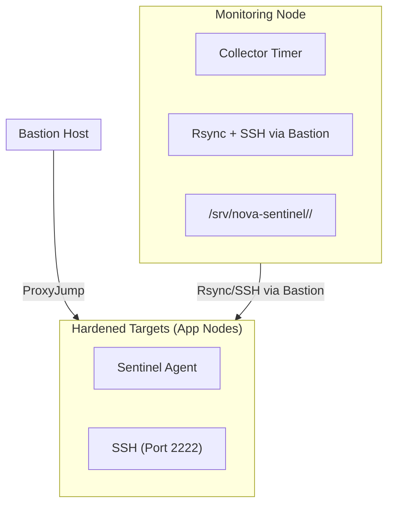
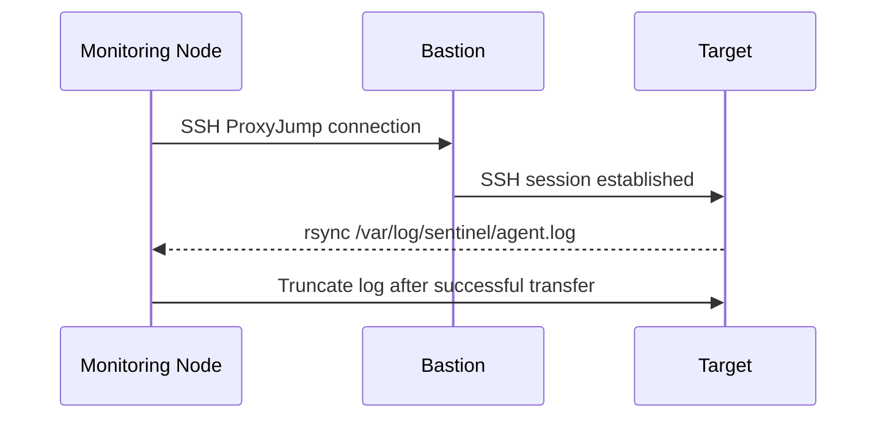
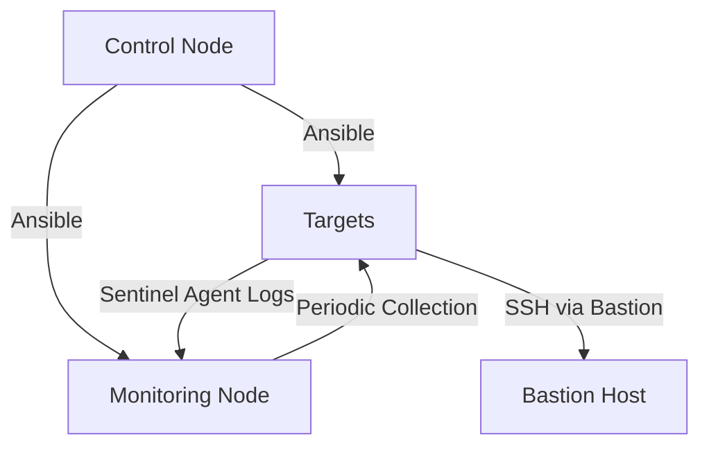

# Nova_sentinel

# 🛡️ Harden and Bootstrap — Ansible Automation

## Overview

`harden-and_bootstrap` is an **Ansible automation playbook** designed to securely bootstrap, harden, and configure Linux hosts.  
It also deploys a lightweight **Nova Sentinel agent** for monitoring and a **collector** on a monitoring node to aggregate logs through a bastion host.

This system enforces:
- 🔐 **SSH Hardening** — Key-only authentication, no root login  
- 🚧 **Firewall Rules (UFW)** — Bastion-only access  
- 🧰 **Admin Setup** — Secure `adminansible` account with passwordless sudo  
- 🧩 **Sentinel Agent Deployment** — Lightweight monitoring daemon  
- 🛰️ **Central Log Collection** — Automated via systemd timers

---

## 🧭 Architecture



---

## ⚙️ Playbook Structure

📄 **File:** `harden_and_bootstrap.yml`

### 🔹 Play 1 — Bootstrap + SSH Hardening
Executed as a temporary privileged user.

**Purpose:** Secure each host before further configuration.

**Main tasks:**
1. Ensure Python3 is available.
2. Create admin account (`adminansible`).
3. Configure passwordless sudo.
4. Set up SSH keys and harden daemon configuration.
5. Enforce UFW firewall (SSH access restricted to bastion).
6. Restart and validate SSH on custom port (`2222`).

**Validation examples:**
```bash
sudo sshd -t -f /etc/ssh/sshd_config
sudo ufw status verbose
sudo systemctl status ssh
```

---

### 🔹 Play 2 — Continue Bootstrap (as Hardened Admin)

Executed through the newly secured SSH connection (`adminansible@<target>:2222`).

**Main tasks:**
- Wait for package locks.
- Install core packages (`python3`, `pip`, `venv`, `psutil`).
- Create service account (`sentinel`).
- Deploy `sentinel_agent.py` + systemd unit.
- Enable and start the service.
- Remove legacy SSH rules on port 22.

---

### 🔹 Play 3 — Deploy Collector on Monitoring Node

Sets up a scheduled log collector that connects to all hardened hosts through the bastion.

**Main tasks:**
1. Install `rsync` + `openssh-client`.
2. Configure SSH for ProxyJump routing.
3. Deploy collector script and `systemd` units:
   - `sentinel-collector.service`
   - `sentinel-collector.timer`
4. Enable the collector timer (default: every 60s).

**Status check:**
```bash
systemctl list-timers | grep sentinel
journalctl -u sentinel-collector.service --no-pager
```

---

## 🧩 Configuration Files

### 📘 `targets.yml`

Global variables for SSH, firewall, agent, and collector.

```yaml
bastion_ip: "10.XX.XX.XX"
ssh_port: 2222
admin_user: adminansible
ufw_allow_ssh_new_from_bastion: true

# Sentinel
sentinel_install_dir: /opt/sentinel
sentinel_log_dir: /var/log/sentinel
sentinel_user: sentinel
sentinel_group: sentinel

# Collector
monitor_base_dir: /srv/nova-sentinel
collector_interval_sec: 60
collector_ssh_common_args: "-o StrictHostKeyChecking=accept-new -o ProxyJump=adminansible@10.XX.XX.XX"
```

---

### 📘 `targets.ini`
Defines target and monitoring groups.

```ini
[targets]
10.XX.XX.XX  # appnode1
10.XX.XX.XX  # appnode2
10.XX.XX.XX  # monitoringnode

[monitoring]
10.XX.XX.XX  # monitoringnode
```

---

### 📘 Templates Summary

| Template | Description |
|-----------|--------------|
| **`sshd_config.j2`** | Hardened SSH config (port, crypto, root restrictions). |
| **`sentinel.service.j2`** | Runs the agent as `sentinel` with strong isolation. |
| **`sentinel-collector.service.j2`** | One-shot service to pull logs. |
| **`sentinel-collector.timer.j2`** | Periodic schedule for the collector. |
| **`ssh_config.collector.j2`** | SSH client config enabling ProxyJump through the bastion. |

---

## 🧠 Sentinel Agent

**Location:** `/opt/sentinel/sentinel_agent.py`  
**Service:** `sentinel.service`  
**Log Path:** `/var/log/sentinel/agent.log`

### Functionality
- Sends **system heartbeats** with CPU, RAM, and disk usage.
- Uses `psutil` for resource metrics.
- Rotates logs automatically (~10 MB, 3 backups).
- Responds cleanly to system shutdowns.

### Example Output
```
2025-10-29T11:00:00Z [INFO] heartbeat env=production host=appnode1 cpu=3.4 mem=47.2 disk=19.8
```

### Useful Commands
```bash
sudo systemctl status sentinel
sudo tail -f /var/log/sentinel/agent.log
sudo journalctl -u sentinel --no-pager
```

---

## 🛰️ Collector Logic

**File:** `/usr/local/bin/sentinel_collector.sh`  
**Triggered by:** `sentinel-collector.timer`

### Operation Flow



### Features
- Retrieves logs from `[targets]` group.
- Stores logs in `/srv/nova-sentinel/<hostname>/`.
- Uses safe SSH and rsync with automatic retry.
- Fully non-interactive; runs every `collector_interval_sec`.

### Verify
```bash
systemctl status sentinel-collector.timer
journalctl -u sentinel-collector.service -n 10
ls -l /srv/nova-sentinel/
```

---

## 🔒 Security Hardening

| Layer | Security Controls |
|-------|-------------------|
| **SSH** | Port `2222`, no root login, no password auth, modern ciphers |
| **Firewall (UFW)** | Deny all incoming, allow outgoing, bastion-only SSH |
| **Systemd Services** | `NoNewPrivileges`, `ProtectSystem=full`, `MemoryDenyWriteExecute` |
| **Users** | Dedicated: `adminansible` (sudo), `sentinel` (restricted) |
| **Logging** | Rotated and centrally collected |

---

## 🚀 Deployment

### Prerequisites
- Ansible ≥ 2.12 on control node  
- SSH key access to bastion and targets  
- Debian/Ubuntu hosts  
- `community.general` Ansible collection installed:
  ```bash
  ansible-galaxy collection install community.general
  ```

---

## ⚡ Quick Start (Operator Guide)

### 1️⃣ Generate or use an SSH key
```bash
ssh-keygen -t ed25519 -f ~/.ssh/id_ed25519 -C "ansible-admin"
```

### 2️⃣ Update `targets.yml`
Ensure:
```yaml
shared_admin_pubkey: "{{ lookup('file', lookup('env','HOME') + '/.ssh/id_ed25519.pub') }}"
bastion_ip: "10.XX.XX.XX"
```

### 3️⃣ Validate Inventory
Check reachability:
```bash
ansible -i inventory/targets.ini targets -m ping -u <temporary_user> --ask-pass
```

### 4️⃣ Run Bootstrap
```bash
ansible-playbook -i inventory/targets.ini playbooks/harden_and_bootstrap.yml
```

### 5️⃣ Reconnect using Hardened Access
```bash
ssh -p 2222 adminansible@<target_ip>
```

### 6️⃣ Verify Deployment
```bash
sudo systemctl status sentinel
sudo systemctl status sentinel-collector.timer
```

---

## 🧩 Maintenance

- Logs collected under `/srv/nova-sentinel/`.
- Manually trigger collection:
  ```bash
  sudo systemctl start sentinel-collector.service
  ```
- Clean old logs:
  ```bash
  find /srv/nova-sentinel -type f -mtime +30 -delete
  ```

---

## 🧾 Summary Diagram


